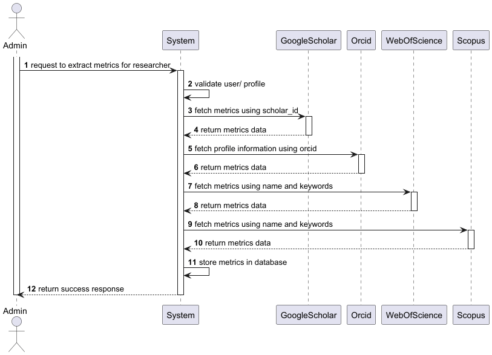
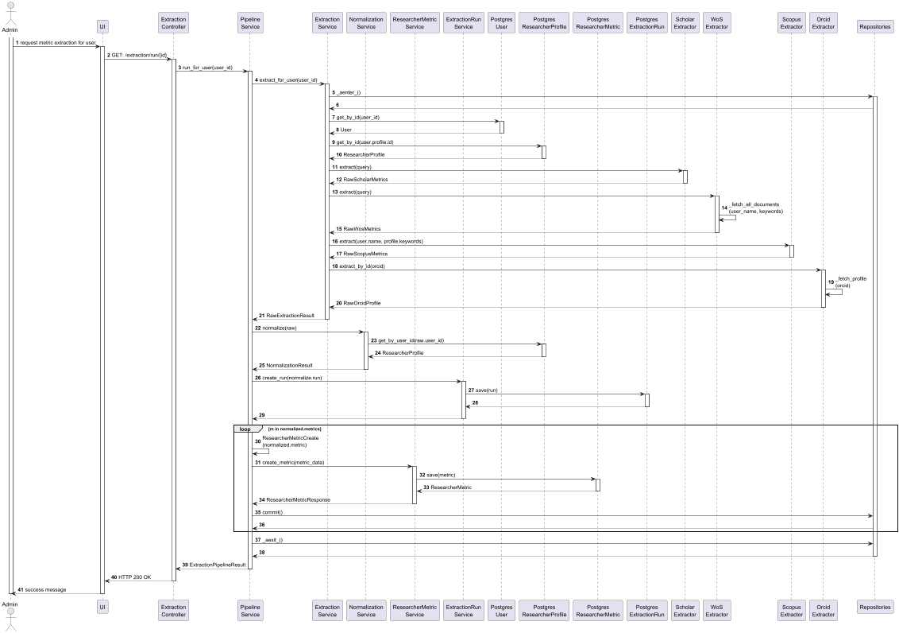

# Export Researcher Metrics

## Context

**US:** As an administrator I want the system to automatically update
researcher metrics on the system on a weekly basis (Google Scholar,
ORCID, WoS, Scopus).

**US:** As an administrator I want the system to automaticaly normalize and
deduplicate data, so that the process of extraction is less manual.

## Design

### Domain Classes
- **ResearcherMetric**
    - Represents the metrics associated to a researcher profile.
    - Contains the data related to the researcher's performance and
    impact.
    - Can be extracted of various sources.

- **ResearcherProfile**
  - Represents the researcher profile associated to users of the
    system.
  - Contains the associated metrics.

- **ExtractionRun**
  - Represents a run of extraction of metrics for a given profile at a 
  given time.
  - Stores the attempted and succeeded sources.

### Controller
- **ExtractionController**
    - Handles the input from the user interface.
    - Invokes the application service to execute the use case.
    - Returns the response (success or validation errors) to the UI layer.

###  Repository
- **PostgresResearcherMetricsRepository**
    - Provides access to persisted `ResearcherMetric` entities.
    - Responsible for checking uniqueness and saving new metrics.
  
- **PostgresResearcherProfilesRepository**
  - Provides access to persisted `ResearcherProfile` entities.
  - Responsible for checking uniqueness and updating the profile.
  
- **PostgresUsersRepository**
  - Provides access to persisted `User` entities.
  - Responsible for checking uniqueness and the existing of the user
  which metrics are being extracted for
  
- **PostgresExtractionRunRepository**
  - Provides access to persisted `ExtractionRun` entities.
  - Responsible for checking uniqueness and saving new runs.

### Helper Classes
For the implementations of this US's, regarding the modularity of the system,
and the ease of future expansibility, the extraction for different sources was
implemented in a modular manner through helper classes - extractors - for
each font:

- **ScholarExtractor**
  - Responsible for the extraction of metrics from Google Scholar.
  - Can extract the cites_per_year and 5y metrics fields.
  - Searches using the scholar_id of the researcher

- **WosExtractor**
  - Responsible for the extraction of metrics from Web of Science.
  - Can extract information for publications from the researcher.
  - Searches by cross-referencing the name and keywords of the 
  researcher
  
- **ScopusExtractor**
- Responsible for the extraction of metrics from Scopus.
- Extract basic metrics, like h-index.
- Searches using the scopus_id of the researcher.

- **OrcidExtractor**
  - Responsible for the extraction of profile information from ORCID.
  - Can extract biography and keywords.
  - Searches using the orcid of the researcher.

### Realization

#### SSD's



#### SD's



**Note:** The automatic extraction follows the exact same architectural patterns
presented for the manual metric extraction. The only difference is the triggering,
instead of being the user, is the system itself.

### Tests

Include here the main tests used to validate the functionality. Focus on how they relate to the acceptance criteria. May be automated or manual tests.

**Test 1:** *Verifies that it is not possible to ...*

```
@Test(expected = IllegalArgumentException.class)
public void ensureXxxxYyyy() {
	...
}
````

## Observations

*This section should be used to include any content that does not fit any of the previous sections.*

*The team should present here, for instance, a critical prespective on the developed work including the analysis of alternative solutioons or related works*

*The team should include in this section statements/references regarding third party works that were used in the development this work.*
