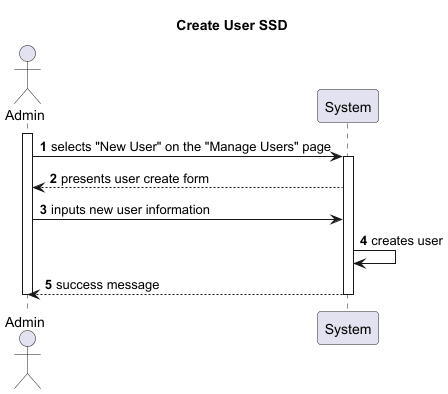
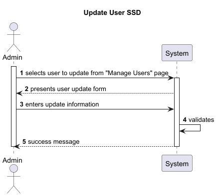
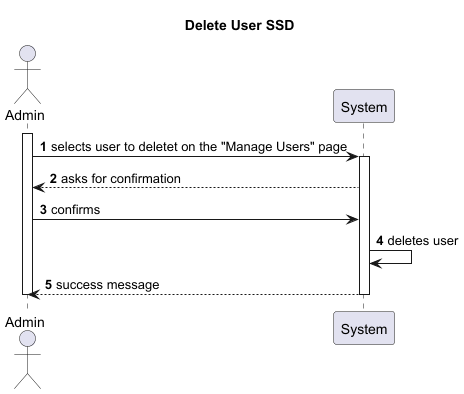
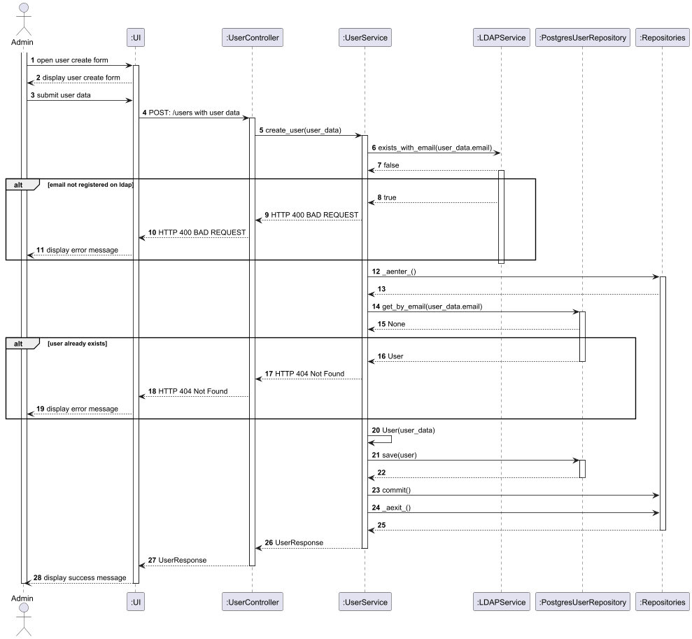
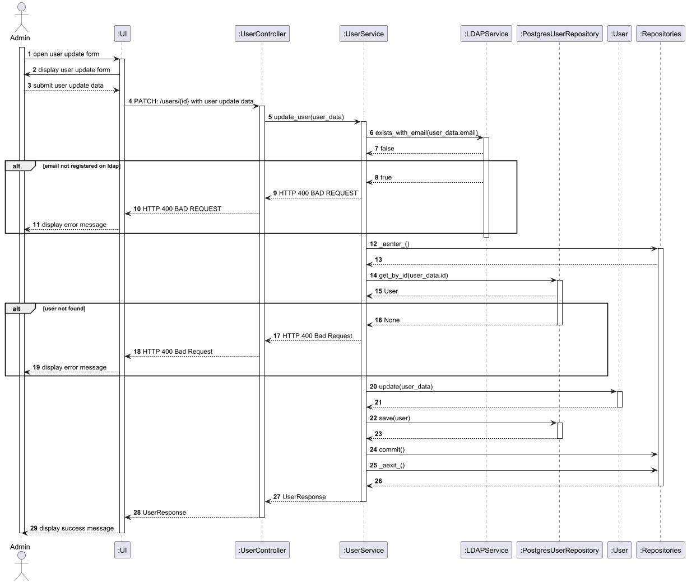
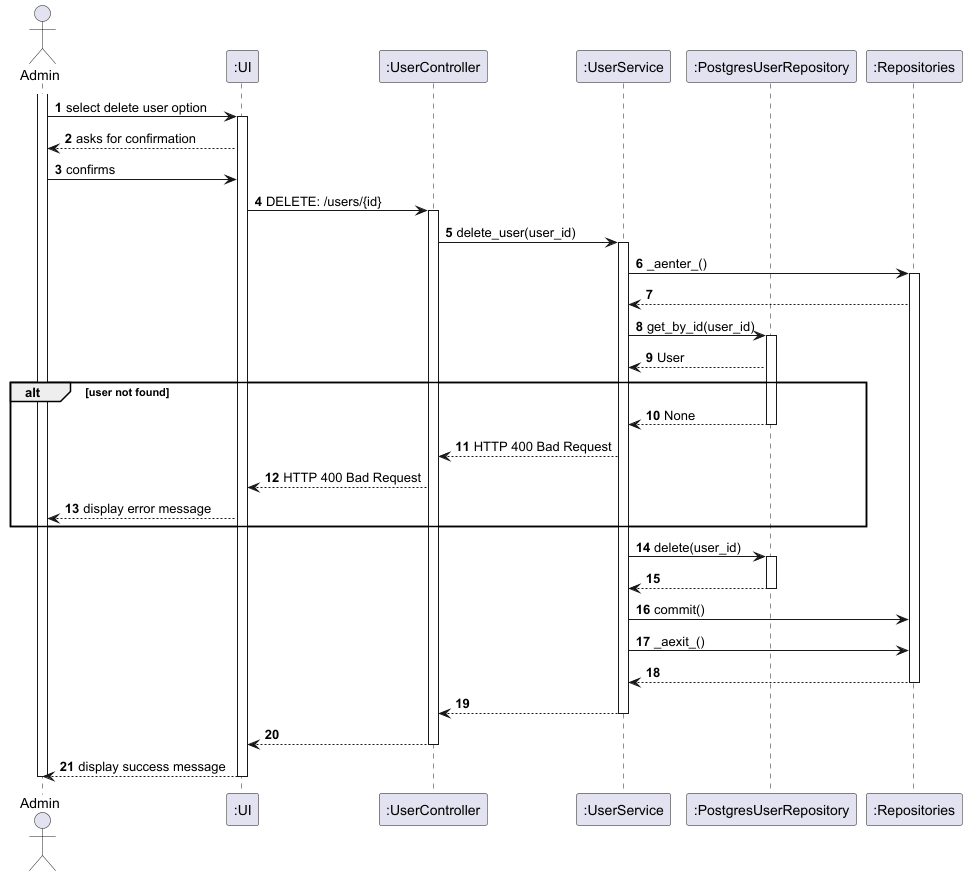

# Manage Users

## Context

**US:** As an administrator I want to manage system users so that I can
control who has access to the system and their permissions. I want to
be able to create new users, update existing users, and delete users
when necessary. When creating or updating a user, it should be taken into 
account that the email must be unique in the system and that the email
must be valid in the LDAP server.

## Design

### Domain Classes
- **User**
    - Represents the user of the system, researcher or administrator.
    - Contains the business rules related to uniqueness, default status, 
  and validation of user.

### Controller
- **UserController**
    - Handles the input from the user interface.
    - Invokes the application service to execute the use case.
    - Returns the response (success or validation errors) to the UI layer.

###  Repository
- **PostgresUserRepository**
    - Provides access to persisted `User` entities.
    - Responsible for checking uniqueness and saving new users.

### Realization

#### SSD's






#### SD's





### Tests

Include here the main tests used to validate the functionality. Focus on how they relate to the acceptance criteria. May be automated or manual tests.

**Test 1:** *Verifies that it is not possible to ...*

```
@Test(expected = IllegalArgumentException.class)
public void ensureXxxxYyyy() {
	...
}
````

## Observations

*This section should be used to include any content that does not fit any of the previous sections.*

*The team should present here, for instance, a critical prespective on the developed work including the analysis of alternative solutioons or related works*

*The team should include in this section statements/references regarding third party works that were used in the development this work.*
